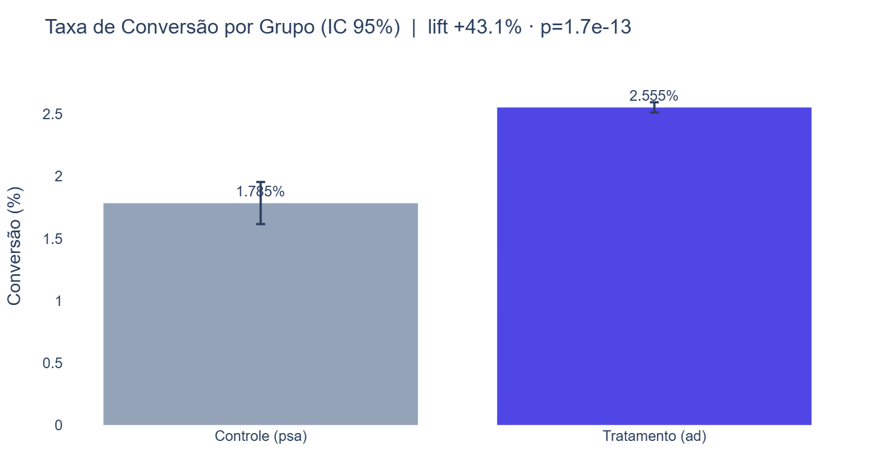
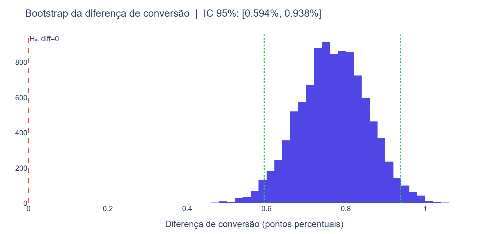
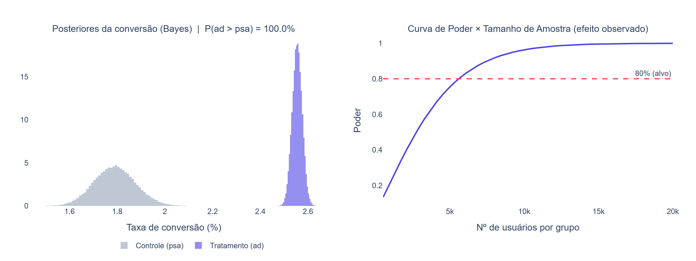

# 🧪 Análise de Teste A/B — Conversão em E-commerce

> Análise estatística completa de um teste A/B de marketing, do teste de hipótese à recomendação de negócio — com teste Z, intervalos de confiança, tamanho de efeito, poder, bootstrap e abordagem bayesiana

---

## 📌 Sobre o Projeto

Projeto de **estatística aplicada / experimentação** sobre um teste A/B real de marketing
([Marketing A/B Testing](https://www.kaggle.com/datasets/faviovaz/marketing-ab-testing), ~588 mil usuários):

- **`ad`** (tratamento): usuários expostos aos anúncios da campanha
- **`psa`** (controle): usuários expostos a um aviso institucional (placebo)

O objetivo é decidir, com rigor estatístico, se a campanha gera um aumento **real** na taxa de
conversão — e quantificar **magnitude**, **confiança** e **impacto de negócio** do efeito.

### Perguntas respondidas

| # | Pergunta |
|---|----------|
| 1 | A diferença na conversão entre os grupos é estatisticamente significativa? |
| 2 | Qual método estatístico é o adequado e por quê? |
| 3 | Qual o tamanho do efeito e o impacto prático (conversões incrementais)? |
| 4 | A amostra tem poder suficiente? Quantos usuários um teste futuro precisaria? |
| 5 | Qual a probabilidade de o tratamento ser melhor que o controle? |

---

## 📊 Resultados

### Taxa de conversão por grupo



| Grupo | Conversão | Usuários |
|-------|-----------|----------|
| Controle (psa) | **1,785%** | 23.524 |
| Tratamento (ad) | **2,555%** | 564.577 |
| **Lift** | **+0,77 p.p. (+43,1% relativo)** | — |

> **Teste Z de proporções:** Z = 7,37, **p = 1,7 × 10⁻¹³** → diferença altamente significativa.
> IC 95% da diferença: **[0,595%, 0,943%]** (não contém zero).

---

### Validação por Bootstrap



> 10.000 reamostragens da diferença de conversão. A distribuição empírica está **inteiramente à
> direita do zero** (IC 95% bootstrap idêntico ao paramétrico), confirmando o resultado sem depender
> da suposição de normalidade. P(diferença > 0) = **100%**.

---

### Abordagem Bayesiana e Análise de Poder



> **Esquerda:** distribuições posteriores (Beta-Binomial) da conversão de cada grupo — não se
> sobrepõem, e **P(tratamento > controle) = 100%**. **Direita:** curva de poder — a amostra é
> muito maior que a necessária para detectar o efeito (poder ≈ 100%).

---

## 🎯 Conclusão de negócio

- A variação **vence o controle** por todos os critérios (frequentista, bootstrap e bayesiano).
- **Impacto estimado:** ~**4.343 conversões incrementais** no grupo de tratamento (IC 95%: 3.360–5.326).
- ⚠️ **Nuance estatística importante:** o **Cohen's h = 0,053** classifica o efeito como "muito
  pequeno", mas isso **não contradiz** o lift de +43%. O Cohen's h comprime diferenças entre
  proporções próximas de zero; para conversões baixas (~1,8%), as métricas certas para o negócio
  são o **lift relativo** e o **lift absoluto × volume**, não o `h` isolado. Significância
  **estatística** ≠ significância **prática** — e ambas precisam ser lidas no contexto da taxa-base.

---

## 🔬 Metodologia estatística

| Etapa | Técnica | Por quê |
|-------|---------|---------|
| Teste de hipótese | **Teste Z de 2 proporções** | Variável binária (converteu/não) + amostras grandes → normalidade pelo TCL |
| Incerteza | **Intervalo de confiança** da diferença | Mostra a faixa plausível do efeito, não só o p-value |
| Magnitude | **Tamanho de efeito (Cohen's h)** | Separa significância estatística de relevância prática |
| Planejamento | **Análise de poder + sample size (MDE)** | Avalia se a amostra é suficiente e dimensiona testes futuros |
| Robustez | **Bootstrap** | Valida o resultado sem suposições paramétricas |
| Decisão | **Bayesiano (Beta-Binomial)** | Responde diretamente "P(tratamento > controle)" |
| Métrica contínua | **Teste t de Welch + Mann-Whitney** | Compara médias e distribuições, robusto à não-normalidade |

---

## 🖥️ Dashboard Interativo

Dashboard com **seletor de nível de confiança** (90% / 95% / 99%) que recalcula o intervalo de
confiança e o veredito de significância em tempo real, além de KPIs, gráfico de conversão com
barras de erro e a distribuição bootstrap.

**Como rodar:**
```bash
pip install -r requirements.txt
python dashboard/app.py
# Acesse: http://localhost:8050
```

---

## 🚀 Como Executar

### 1. Instalar dependências
```bash
python -m venv .venv
.venv\Scripts\activate          # Windows
pip install -r requirements.txt
```

### 2. Baixar o dataset
Acesse [Kaggle — Marketing A/B Testing](https://www.kaggle.com/datasets/faviovaz/marketing-ab-testing),
baixe `marketing_AB.csv` e coloque-o na pasta `data/`.

### 3. Rodar o notebook
```bash
jupyter notebook notebooks/01_analise_ab.ipynb
```

### 4. Rodar o dashboard / regenerar imagens
```bash
python dashboard/app.py
python generate_screenshots.py
```

---

## 📁 Estrutura do Projeto

```
ABTest-Ecommerce/
│
├── data/                          # marketing_AB.csv (não versionado)
│   └── .gitkeep
│
├── notebooks/
│   └── 01_analise_ab.ipynb        # Análise estatística completa
│
├── dashboard/
│   └── app.py                     # Dashboard interativo Plotly Dash
│
├── images/                        # Gráficos exportados para o README
├── generate_screenshots.py        # Gera os PNGs deste README
├── requirements.txt
└── README.md
```

---

## 🛠️ Tecnologias


---

## 📚 Conceitos Aplicados

| Conceito | Descrição |
|----------|-----------|
| **Teste de hipóteses** | H₀/H₁, nível de significância, p-value, decisão bicaudal |
| **Teste Z de proporções** | Comparação de duas proporções independentes |
| **Intervalo de confiança** | Faixa plausível para a diferença de conversão |
| **Tamanho de efeito** | Cohen's h (proporções) e Cohen's d (médias) |
| **Análise de poder** | Poder post-hoc e cálculo de tamanho de amostra (MDE) |
| **Bootstrap** | Inferência não-paramétrica por reamostragem |
| **Inferência bayesiana** | Posterior Beta-Binomial e P(tratamento > controle) |

---

## 🔮 Próximas Etapas

- [ ] Segmentar o efeito por dia/hora de maior exposição (`most_ads_day`, `most_ads_hour`)
- [ ] Monitorar efeito ao longo do tempo (novelty effect)
- [ ] Correção para múltiplas comparações (Bonferroni / FDR) ao testar vários KPIs
- [ ] Teste sequencial para encerramento antecipado

---

## 📖 Fonte dos Dados

> **Marketing A/B Testing Dataset**
> [kaggle.com/datasets/faviovaz/marketing-ab-testing](https://www.kaggle.com/datasets/faviovaz/marketing-ab-testing)

---

## 👨‍💻 Autor

**Augusto Matos** — Analista de Dados & Desenvolvedor Python

[](https://www.linkedin.com/in/augusto-matos-b92887204)
[](mailto:augusto.ivan83@outlook.com)
[](https://github.com/augmatos)
